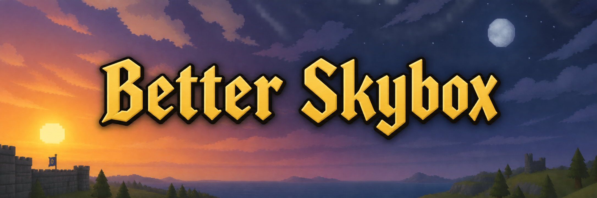
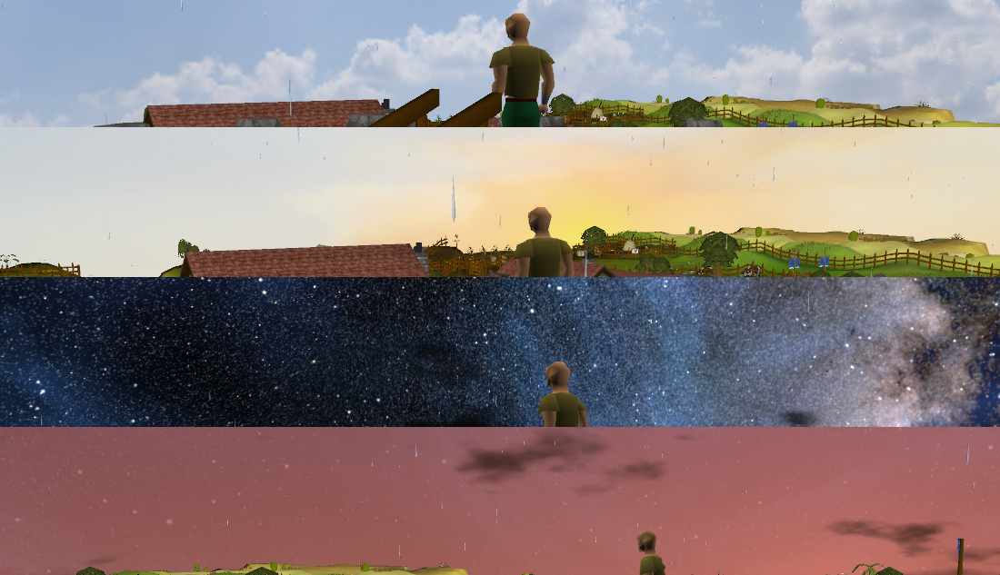

<p align="center">
  <a href="https://www.buymeacoffee.com/314159DD"></a>
</p>



# Better Skybox

Real skies for the standard RuneLite GPU renderer: cubemap and procedural skies, a day/night cycle, moon phases,
stars, weather, and per-area skies and fog.

## What it is

Better Skybox is the standard GPU renderer with a sky pass on top: where the stock plugin fills the sky with a
flat fog colour, this one draws a real sky, either a photographed cubemap or a procedural sky with a sun, a moon
and stars that follow the time of day. It is not 117 HD; the game looks exactly like it does under the stock GPU
plugin, and only the sky is different. Turn it on and the GPU plugin turns itself off, and your GPU settings are
carried over, so nothing else about your client changes.

## Why the download is 35 MB

The jar bundles 21 CC0 skies in full quality (13 from Poly Haven, 5 from ambientCG, 3 stylised ones from
OpenGameArt) plus NASA's Deep Star Map for the procedural night sky. That is where the size goes. RuneLite
downloads a plugin once and keeps it, so you pay the 35 MB one time, not on every start.

## Settings

The panel has five collapsible sections. RuneLite cannot grey out settings that do not apply, so pick the Sky type
in the Sky section and open the matching section below it.

- **Renderer** (closed by default): the stock GPU plugin's settings, draw distance to render threads. Filled from
  your GPU plugin settings the first time Better Skybox starts.
- **Sky**: the switch, the sky type (cubemap or procedural), the time of day, overworld only, lightning.
- **Cubemap sky**: which bundled sky to show, the dawn/dusk/night companions, the star map over night skies,
  sky by area, the fades.
- **Procedural sky** (closed by default): sun, moon, stars, clouds, night-sky extras, area moods.
- **Fog and blending**: how the sky meets the terrain, for both sky types. Fog depth lives here too.

| Setting | Default | What it does |
| --- | --- | --- |
| Enable sky | on | draw a sky instead of the flat fog colour |
| Sky type | CUBEMAP | CUBEMAP is a texture, PROCEDURAL is a gradient sky with sun, moon and stars |
| Time of day | DAY | for both sky types: DAY, SUNRISE, DAWN, SUNSET, DUSK, NIGHT, BLOOD_MOON, CLOCK (your local time), CYCLE (a full day in Cycle length minutes), CUSTOM (the sun sliders) |
| Cycle length | 24 | Time of day = CYCLE: real minutes for one full day |
| Overworld only | on | underground and in dungeons the flat colour stays |
| Prefer game skybox | off | where the game ships its own skybox model, draw that instead |
| Lightning | on | random flashes where 117 HD marks storms: high Wilderness, Barrows, Draynor Manor and its forest, the Misthalin Mystery Manor, Tempoross Cove |
| Cubemap | PARTLY_CLOUDY | one of the 21 bundled skies, DEBUG, or CUSTOM for your own folder. With Sky by area on, this is the sky for unmapped areas |
| Custom cubemap folder | | folder name under `~/.runelite/better-skybox/` used when Cubemap = CUSTOM |
| Sky by time | on | dawn, day, dusk and night cubemaps follow the Time of day; day is the Cubemap above or the area's own sky |
| Dawn / Dusk / Night cubemap | DAWN / SUNSET / NIGHT | the other three phases, unless an area brings its own |
| Star map on night skies | on | draw the NASA star map over the bundled night cubemaps and over any sky you picked as a night one, so the photo's blurry star blobs give way to real ones |
| Night sky dimming | 50 | how far the photo sky is darkened where the star map is drawn, in percent |
| Sky by area | on | sky and fog colour follow the map area you are in; unmapped areas use the Cubemap above |
| Time fade | 4 | seconds to crossfade on a time-of-day or settings change |
| Area fade | 8 | tiles to walk past an area border until the new sky is fully in; walking back reverses the blend |
| Rotation / Drift speed | 0 / 0 | cubemap: fixed offset in degrees, drift in degrees per minute |
| Sun altitude / azimuth | 30 / 235 | procedural, Time of day = CUSTOM |
| Sun disk | on | procedural: draw the sun itself, not only its glow |
| Moon, Stars | on | procedural |
| Moon size / Moon phase | 100 / 100 | procedural, percent; phase 0 is a new moon. Under CLOCK and CYCLE the moon follows the calendar instead |
| Real star map | on | procedural: NASA's Deep Star Map (Gaia DR2) turning with the time of day, instead of generated stars |
| Star brightness | 100 | procedural, percent |
| Shooting stars, Nebula, Aurora | on / on / off | procedural night-sky extras |
| Cloud cover / Cloud speed | 30 / 100 | procedural, percent; 0 cover is a clear sky, 0 speed is still air |
| Area moods | on | procedural: areas override the Time of day (Morytania stays at dusk, Darkmeyer under a blood moon, the desert at high noon) |
| Fog depth | 0 | the stock terrain fog; 0 turns it off |
| Fog colour | AUTO | AUTO takes the area's fog colour from 117 HD's tables, else the game colour, else the sky. SKYBOX uses the sky's horizon colour, GAME the client's colour (black without the Skybox colour plugin), CUSTOM the colour below |
| Custom fog colour | light blue-grey | used with Fog colour = CUSTOM |
| Horizon blend | 5 | how far above the horizon the fog colour fades into the sky; 0 is off |
| Horizon offset | 10 | degrees the sky horizon sits below the true horizon; raise it if a flat band shows above the terrain edge |
| Fog tint | 15 | share of the fog colour mixed into the whole sky |
| Sky brightness | 100 | multiplier in percent |

On first start the plugin copies your stock GPU plugin settings (draw distance, anti-aliasing, FPS settings and
the rest, 16 in all) into its Renderer section, once. After that the two plugins keep separate settings, so a
change in one does not touch the other.

## Area skies

With Sky by area on, the sky and the fog colour follow where you are. The area table comes from 117 HD's
`areas.json` and `environments.json`: 162 areas, 75 with a sky of their own, every one with 117 HD's fog colour,
which Fog colour = AUTO uses. Morytania is overcast, the Wilderness is storm clouds, the Kharidian desert is a
clear hard blue, the Fremennik province has mountain air and its northern isles a snow sky, Tirannwn is misty,
and the kingdoms of Misthalin, Asgarnia and Kandarin each get a day sky of their own.

Areas can carry their own time-of-day set (a night or dusk sky that fits the place), a mood for the procedural
sky (Morytania stays at dusk, Darkmeyer sits under a blood moon, the desert is always high noon) and lightning
where 117 HD marks storms.

Crossing a border eases the sky over the next Area fade tiles; walking back reverses the blend rather than
restarting it. A sky you have not seen yet in this session is decoded in the background while the current one
stays on screen, so a border never freezes a frame. Teleports and time-of-day changes use the Time fade in
seconds instead.

## Custom skies

Put your own sky in a folder under `~/.runelite/better-skybox/` (on Windows that is
`%USERPROFILE%\.runelite\better-skybox\`):

```
~/.runelite/better-skybox/<name>/px.png nx.png py.png ny.png pz.png nz.png
```

Six square faces of the same size, or a single `skybox.png` atlas of 4x2 faces laid out as `px nz nx pz` on the
top row and `py ny` on the bottom row. Then set Cubemap = CUSTOM and type the folder name into Custom cubemap
folder. If the folder cannot be read the plugin falls back to the bundled sky and says so once in the chat box:
`Better Skybox: custom sky folder <name> not found, using PARTLY_CLOUDY` (or `no custom sky folder set` while the
name is empty).

A folder named like a bundled sky (for example `qwantani_night_puresky`) replaces that sky wherever it is used,
including in the area table.

To change which sky an area gets, drop your own `sky_areas.json` into `~/.runelite/better-skybox/`; it replaces
the bundled table without a rebuild. The bundled file, and the script that generates it, are described in
[CONTRIBUTING.md](CONTRIBUTING.md).

## FAQ

**Does it work with 117 HD?** No. Both plugins replace the renderer, and RuneLite has one renderer slot, so
the two cannot be on at the same time. Better Skybox is for players who want the vanilla look with a sky.

**Does it change the game's colours?** No. The terrain, models and lighting are drawn by the stock GPU code; the
sky pass only touches the pixels behind the scene. Fog colour and fog depth are yours to set, as they are in the
GPU plugin.

**What does it cost in performance?** One extra full-screen pass per frame for the sky. It is not noticeable
next to the scene itself. Cubemaps are decoded on a background thread, and the 10 MB star map is only loaded
while a sky that draws it is on screen.

**Why do the night cubemaps have crisp stars now?** The bundled night skies are 512 px photo HDRIs, so their
stars come out as soft blobs. With Star map on night skies the plugin dims that sky a little above the horizon
and draws the same NASA Deep Star Map the procedural sky uses over it, turning with the time of day. It applies
to NIGHT, MOONRISE and AURORA_NIGHT, to any area's own night sky, and to whatever you set as the Night cubemap,
your own folders included. Turn it off, or take the dimming to 0, to get the plain photo back.

**Why does the GPU plugin switch off when I turn this on?** RuneLite lets one plugin draw the scene at a time.
Better Skybox contains the stock renderer, so nothing is lost; turn it off and the GPU plugin comes back.

**Where are my GPU settings?** In the Renderer section, closed by default. They were copied from the GPU plugin
the first time Better Skybox started.

**Can I use RuneScape 3's skies?** They are not bundled (Jagex assets). If you own the game files and have
ripped a set, drop it into a custom folder and pick CUSTOM.

## Credits

- Stock GPU renderer: [RuneLite](https://github.com/runelite/runelite), BSD-2-Clause.
- Cubemap and procedural sky model: 117 HD pull requests #558 (RuffledPlume) and #655 (3-X), BSD-2-Clause.
- Area and fog tables: 117 HD `areas.json` and `environments.json`, BSD-2-Clause.
- Sky panoramas: [Poly Haven](https://polyhaven.com) (CC0), [ambientCG](https://ambientcg.com) (CC0),
  Screaming Brain Studios "Cloudy Skyboxes" on [OpenGameArt](https://opengameart.org) (CC0).
- Star map: NASA/Goddard Space Flight Center Scientific Visualization Studio,
  [Deep Star Maps 2020](https://svs.gsfc.nasa.gov/4851). Star data: Gaia DR2, ESA/Gaia/DPAC.

Full attribution per file is in [NOTICE](NOTICE). Better Skybox itself is BSD-2-Clause, see [LICENSE](LICENSE).
Bugs and ideas go to the [issue tracker](https://github.com/314159DD/better-skybox/issues); how to build and
hack on it is in [CONTRIBUTING.md](CONTRIBUTING.md).
